# 2026 OOPL Final Report

## 組別資訊

組別：T45  
組員：113820032 曾靖諺  
復刻遊戲：超級炸彈人  

## 專案簡介

### 遊戲簡介
超級炸彈人 是一款參考 Super Bomberman R2 中城堡模式的遊戲。原作 Super Bomberman R2 為 3D 遊戲，本專案將其中的城堡模式復刻成類似 Super Bomberman 5 的 2D 版本，雙方圍繞場地上的「鑰匙」與「寶箱」展開攻防對決。  

遊戲分為 `進攻方` 與 `防守方`。  

`進攻方` 最多 8 人，需閃避炸彈、陷阱、源石精靈與防守方的武器攻擊，最終取得鑰匙、開啟場上所有寶箱即可獲勝。  

`防守方` 只有 1 人，利用地圖陷阱、炸彈與源石精靈防禦進攻方。只要在時間內守住任一寶箱，就能獲得勝利。  

* **會死掉：** 
  - **進攻方：** 進攻方會被陷阱、源石精靈、炸彈爆炸與防守方的武器攻擊波及，受到攻擊就會死亡；死亡的進攻方會掉落身上的鑰匙，並進入重生倒數。  
  - **防守方：** 防守方有 3 條命，會被陷阱與炸彈爆炸波及；前 2 次受到攻擊只會倒地暈眩一段時間，第 3 次才會死亡，並進入重生倒數。  
* **會獲勝：**
  - **進攻方獲勝：** 成功取得鑰匙並成功開啟所有寶箱
  - **防守方獲勝：** 成功拖延至倒數計時結束
* **有關卡：** 每個關卡都有不同的陷阱、寶箱、源石精靈配置

### 組別分工
單人實作，無須分工

## 遊戲介紹

### 遊戲規則

**基本操作**
- `ESC`：於主選單或遊戲封面按 `ESC` 可以開啟結束遊戲確認框
- `ENTER`：於遊戲中按 `ENTER` 可以開啟暫停選單，可選擇繼續、作弊開關、再次開始、返回房間
- `F3`：開啟 / 關閉 Debug Overlay 與 ImGui 主控台（即時改金幣、殺指定玩家、強制進攻方 / 防守方獲勝、可視化危險地圖等）

預設按鍵（可於操作設定畫面自訂並保存）：

| 動作 | 玩家 1（守方） | 玩家 2（攻方） |
|:----:|:----:|:----:|
| 上 / 下 / 左 / 右 | W / S / A / D | ↑ / ↓ / ← / → |
| 放置炸彈 | Space | Right Shift |
| 武器發動 | E | （守方專用） |

**對戰流程**
1. 遊戲封面 → 主選單 → 戰鬥選單 → 進入對戰
2. 對戰中畫面上方顯示倒數計時與剩餘寶箱數；防守方頭頂以皇冠標示，持有鑰匙的進攻方頭頂以鑰匙標示
3. 倒數結束（防守方勝）或所有寶箱被開啟（進攻方勝）時，進入結算畫面並依表現結算金幣，金幣會保存

**核心機制**
- **炸彈與爆炸：** 雙方皆可放置炸彈，引爆後以十字形向四方延伸火焰，遇到可破壞磚塊則炸毀、遇到不可破壞的無敵牆則停止；火焰會引爆相鄰炸彈（連鎖爆炸）
- **重生：** 死亡後約 2 秒於原本的出生點復活，復活後給予 3 秒無敵

**角色與場上單位**

| 圖示 | 名稱 | 說明 |
|:---:|:---:|---|
| 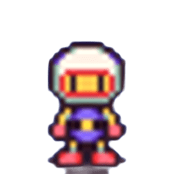 | **炸彈人** | 進攻方與防守方皆可移動與放置炸彈；防守方頭頂以皇冠  標示、持有鑰匙的進攻方頭頂以鑰匙  標示 |
|  | **源石精靈** | 與防守方合作的 AI 單位，平時在地圖上隨機朝四個方向巡邏，發現進攻方（警戒半徑 5 格）則主動追擊 |
|  | **砲台** | 週期性朝面前發射砲彈（射程 2 ~ 3 格），砲彈飛行途中碰到玩家會將其砸暈；並且會自動旋轉，改變射擊方向 |

**陷阱地形**

| 圖示 | 名稱 | 說明 |
|:---:|:---:|---|
|  | **輸送帶** | 站上後強制朝帶動方向位移 |
| 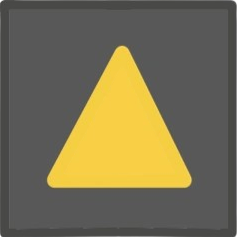 | **彈跳板** | 將角色朝指定方向彈飛數格（飛行途中免疫傷害），觸發後需冷卻 5 秒 |

**目標物**

| 圖示 | 名稱 | 說明 |
|:---:|:---:|---|
|  | **鑰匙 (Key)** | 進攻方需撿取並帶到寶箱前開啟寶箱；持有鑰匙者死亡會原地掉落鑰匙 |
|   | **寶箱 (Chest)** | 進攻方的最終目標，所有寶箱被開啟即進攻方獲勝；防守方守住任一寶箱至倒數結束則防守方獲勝 |

**遊戲道具**

磚塊被破壞後依權重抽選掉落物（55% 掉落空氣，即什麼都沒有）：

| 圖示 | 名稱 | 機率 | 效果 |
|:---:|:---:|:---:|---|
|  | **加速鞋** | 15% | 玩家加速 5 秒（移動速度 3.0f → 5.0f） |
|  | **炸彈道具** | 15% | 增加可放置炸彈數 +1（上限為 10） |
|  | **火焰道具** | 15% | 擴大火焰蔓延半徑 +1（上限為 5） |

**防守方武器**（由防守方於賽前選擇一把，對戰中需充能完畢後才能發動）

| 圖示 | 名稱 | 效果 |
|:---:|:---:|---|
|  | **劍** | 將前方三格的目標擊倒 |
|  | **雷射** | 朝面向直線發射，擊倒命中的目標 |
|  | **屏障** | 生成暫時牆阻擋進攻方 |

**屬性說明**

| 屬性 | 說明 |
|------|------|
| 生命 | 進攻方 1 條；防守方 3 條（前 2 次被擊中會倒地暈眩 1.5 秒，不會直接死） |
| 移動速度 | 預設 3.0f；撿到加速鞋後 5 秒內提升到 5.0f；AI 進攻方依性格為基準速度的 0.78 ~ 0.95 倍（狂戰士 0.95、獵人 0.90、拾荒者 0.84、謹慎者 0.78） |
| 火力 | 炸彈爆炸的十字延伸格數，初始 2，上限 5 |
| 炸彈上限 | 可同時存在的炸彈數，初始 3，上限 10 |
| 金幣 | 結算時依勝負、守住寶箱、武器擊倒數結算並寫入存檔 |

**狀態異常**

| 狀態 | 效果 | 解除 |
|------|------|------|
| 倒地暈眩 | 防守方被擊中時若仍有命，會倒地暈眩 1.5 秒並閃爍星星，期間不能移動 | 自動起身，並給予 1 秒短暫無敵 |
| 無敵 | 重生、起身、作弊開啟時生效，免疫所有傷害 | 計時結束或作弊關閉 |

### 遊戲畫面

| 說明 | 畫面 |
|:------:|:------:|
| 遊戲封面 | 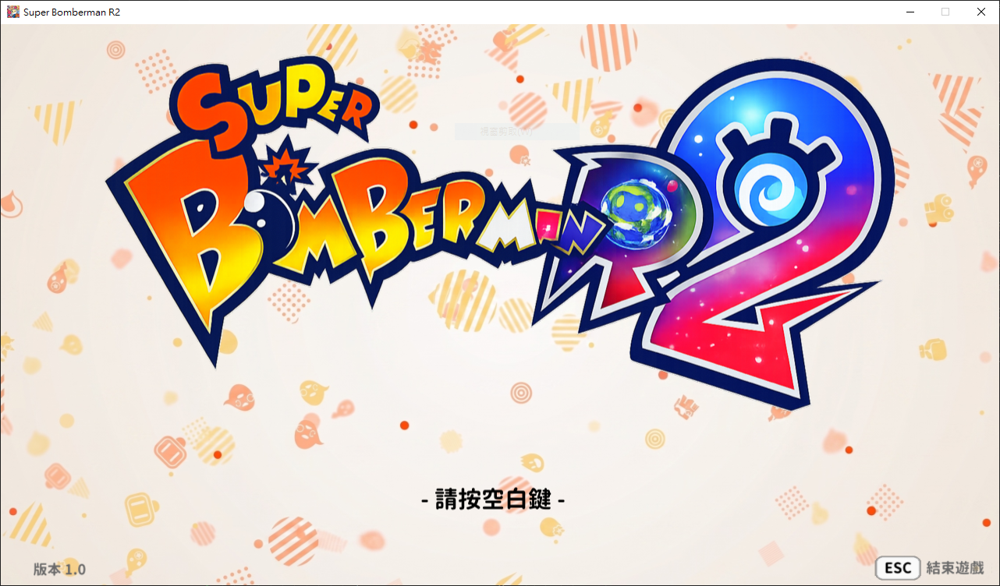 |
| 主選單 | 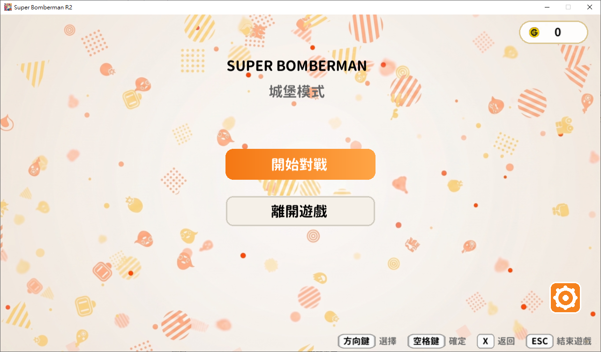 |
| 操作設定 | 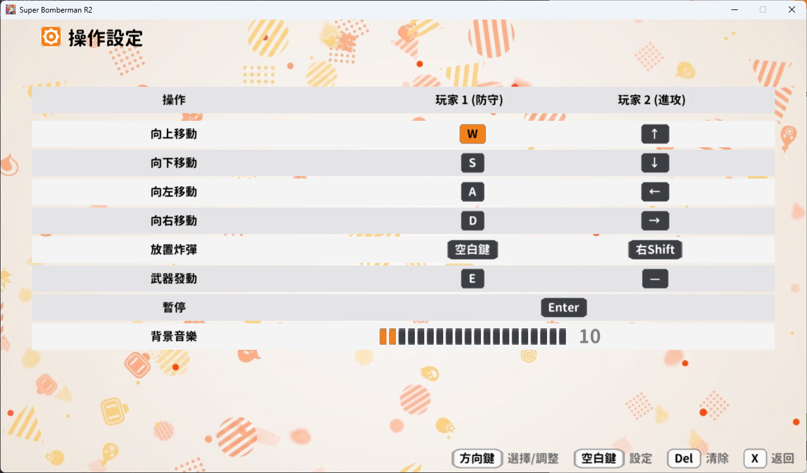 |
| 戰鬥選單 | 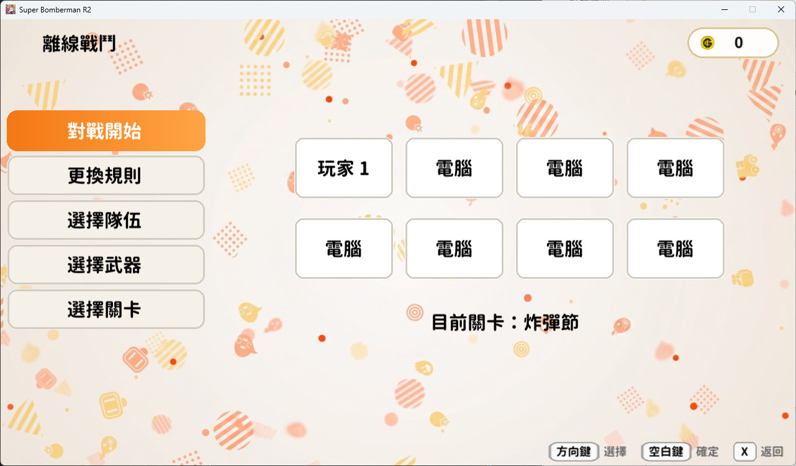 |
| 更換規則 | 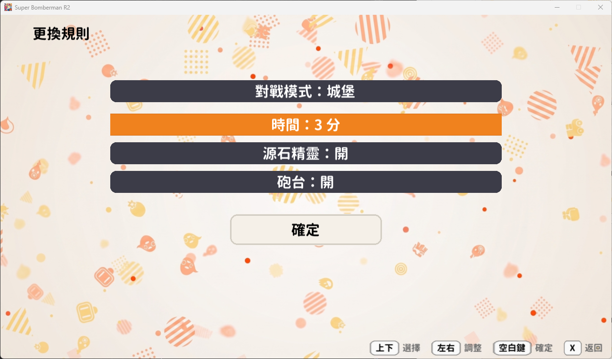 |
| 選擇隊伍 | 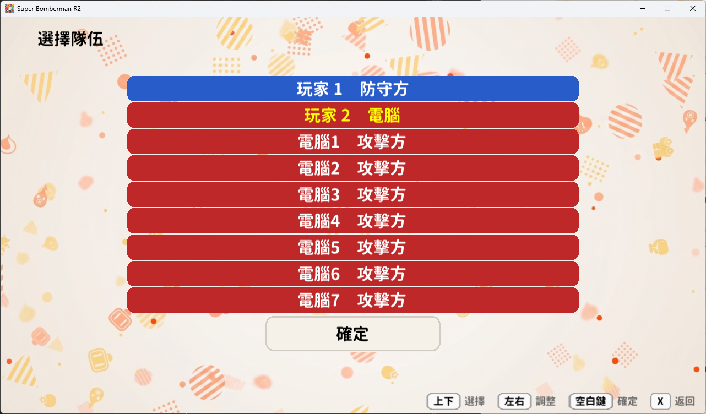 |
| 選擇武器 | 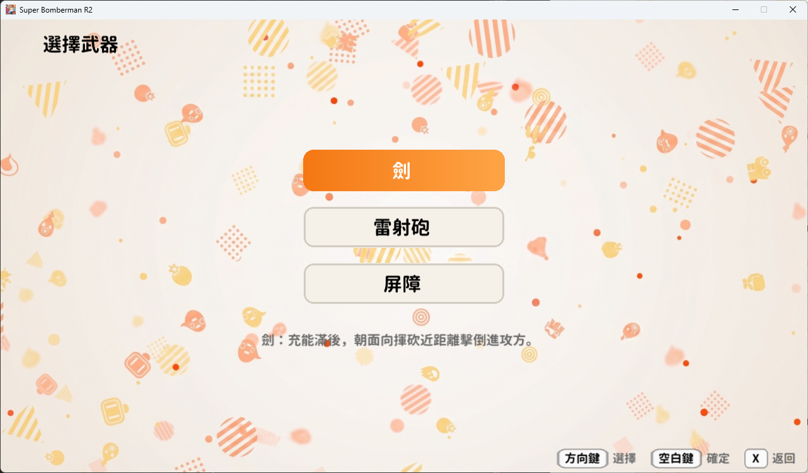 |
| 選擇關卡 | 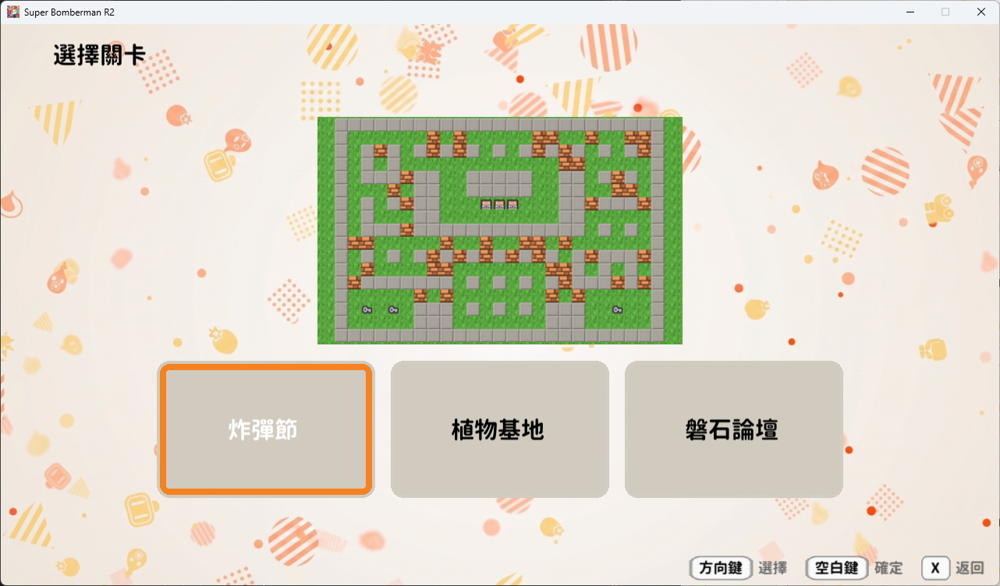 |
| 遊玩畫面 | 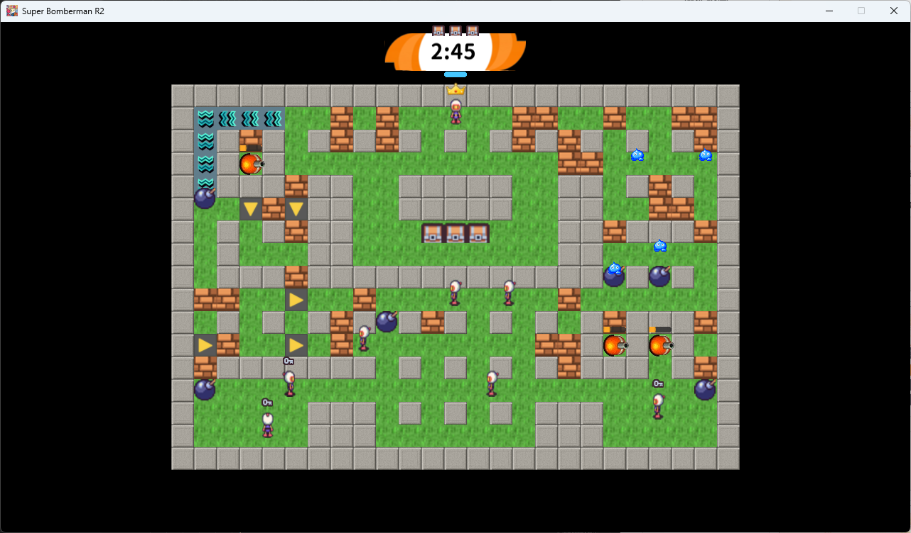 |
| 暫停選單 | 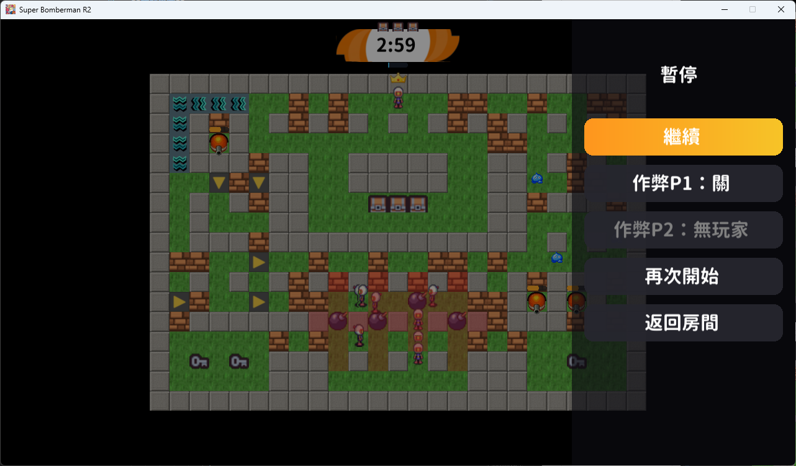 |
| Debug 選單 | 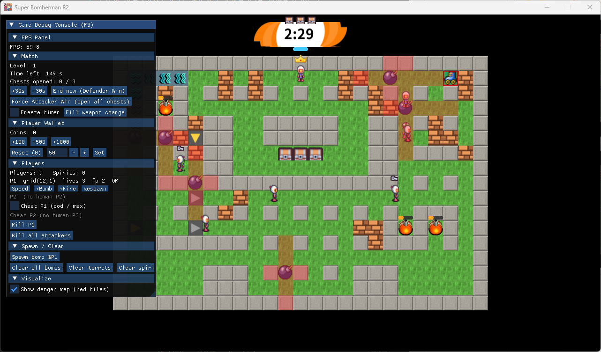 |
| 結算畫面 (防守方獲勝) | 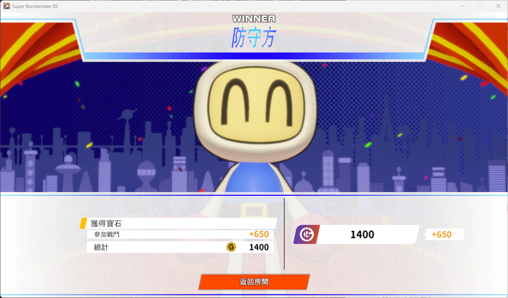 |
| 結算畫面 (進攻方獲勝) | 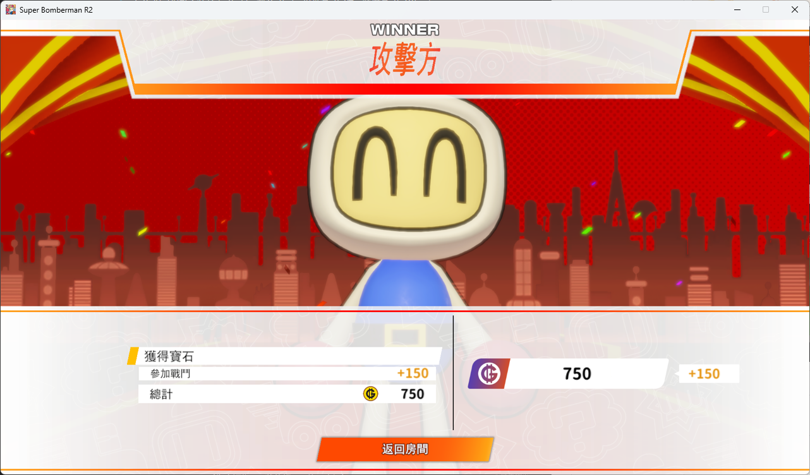 |

## 程式設計

### 程式架構

**專案規模**

- 標頭檔（`.hpp`）：75 個
- 原始檔（`.cpp`）：58 個
- 程式碼總行數：約 7000 多行（不含 PTSD 框架）
- 場景狀態子類（`IGameState`）：11 個
- 防守方武器子類（`IDefenderWeapon`）：3 個
- 可互動物件子類（`Interactable`）：5 個
- AI 性格策略子類（`IBotProfile`）：4 個
- 玩家道具效果子類（`IPlayerEffect`）：3 個
- 地圖磚塊子類（`Tile`）：3 個

以下為省略屬性與方法的純繼承關聯圖，依主題拆成四張以便閱讀（`GameObject` 即 PTSD 框架的 `Util::GameObject`）：

**(1) 遊戲實體：`Util::GameObject` 繼承樹**

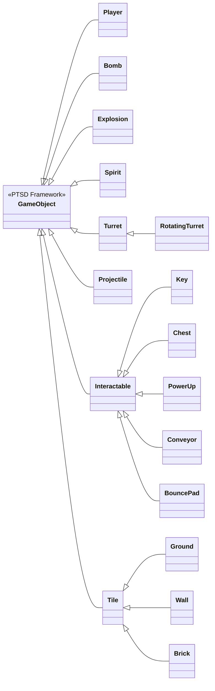

**(2) 場景狀態：`IGameState`（11 個畫面）**

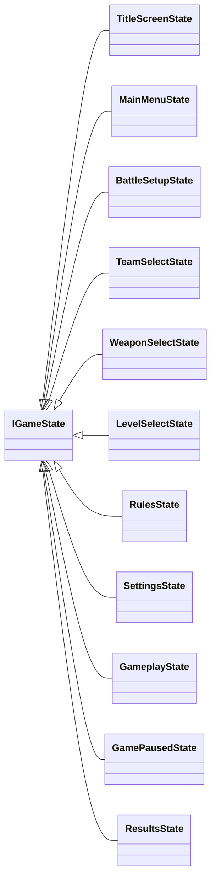

**(3) 武器與輸入控制：`IDefenderWeapon` / `InputController`**

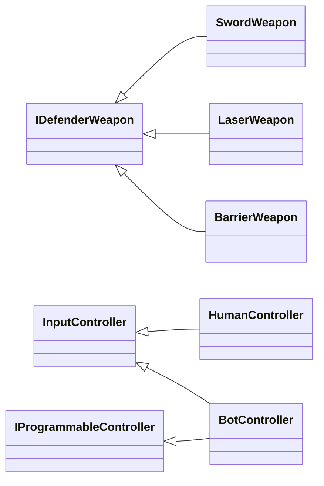

**(4) 策略與工廠：`IPlayerEffect` / `IBotProfile` / `InteractableFactory`**

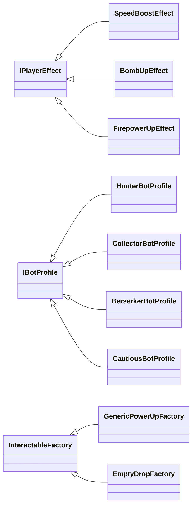

以下的點代表繼承，後面的字代表解釋：

* `Util::GameObject`：PTSD 框架的基礎遊戲物件
  * `Player`：炸彈人
  * `Bomb`：炸彈
  * `Explosion`：火焰
  * `Spirit`：源石精靈
  * `Turret`：砲台
    * `RotatingTurret`：會自動旋轉並射擊的砲台
  * `Projectile`：砲台發射的砲彈
  * `Interactable`：地圖上可互動的物件
    * `Key`：鑰匙
    * `Chest`：寶箱
    * `PowerUp`：道具（透過建構子注入 `IPlayerEffect`，新增道具不必新增 subclass）
    * `Conveyor`：輸送帶
    * `BouncePad`：彈跳板
  * `Tile`：地圖磚塊
    * `Ground`：可通行的地面
    * `Wall`：不可破壞的無敵牆
    * `Brick`：可被炸彈破壞的磚塊（破壞後有機率掉落道具）
* `IGameState`（場景介面）：11 個畫面各為一個 subclass
* `IDefenderWeapon`（武器介面）：3 把武器各為一個 subclass
* `InputController`（移動方式讀取介面）：`HumanController` 讀鍵盤、`BotController` 內部由 AI 寫入
* `IProgrammableController`（可被外部寫入按鍵的介面）：與 `InputController` 拆開避免 `HumanController` 出現無意義的 stub（ISP）
* `InteractableFactory`（磚塊掉落物的靜態工廠）：`GenericPowerUpFactory` 以建構子注入 effect 與 sprite，新增道具不必再寫新工廠 subclass；`EmptyDropFactory` 代表「不掉落」的空結果
* `IPlayerEffect`（道具效果介面）：加速 / 炸彈上限 +1 / 火力 +1 各為一個 subclass，由 `PowerUp` 持有，玩家撿取的瞬間 `Apply()` 到玩家身上
* `IBotProfile`（AI 性格策略介面）：獵人 / 拾荒者 / 狂戰士 / 謹慎者各為一個 subclass，由 `BotProfileFactory` 依席位輪替注入，讓同場 AI 的反應速度、膽量與走速各異

**遊戲狀態移轉圖**
`App` 只持有目前狀態，所有畫面切換皆透過 `App::TransitionTo()` 完成：

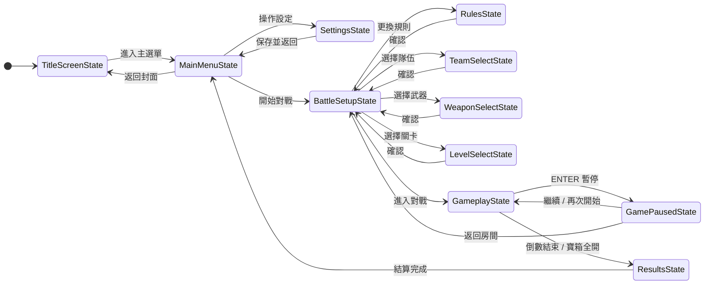

**體現的物件導向原則與設計模式**

- **狀態模式：** `IGameState` 為純虛擬介面（`OnEnter / OnUpdate / OnExit / WantsCursor`），每個畫面是一個子類別；`App` 只持有目前狀態並負責轉場 `TransitionTo()`。新增畫面不需改動 `App` 主迴圈
- **策略模式 + 靜態工廠 + OCP：** 防守方武器抽象為 `IDefenderWeapon::Fire(const FireContext&)`，`Sword / Laser / Barrier` 各自實作；`WeaponFactory` 依 `MatchConfig` 建立對應武器。新增一把武器只需新增一個子類別 + 工廠加一個 case，完全不動既有武器（開放封閉原則，OCP）
- **依賴反轉（DIP）：** 武器不直接依賴具體場景，而是透過 `IWeaponEffects`（特效接收端）與 `IWorldContext`（世界查詢）等介面與外界互動，由 `GameSession` 提供實作。`Player::Update(const IWorldContext&)` 同理
- **單一職責（SRP）：** 原本龐大的 gameplay 邏輯拆成多個 Manager 與職責類別：`Player::Update` 抽出 `PlayerLifecycle`（死亡/暈眩/重生計時）與 `PlayerAnimator`（方向→貼圖）；`GameSession::LoadLevel` 抽出 `LevelSpawner`；`AIManager` 抽出 `BotDecisionMaker`（單幀策略樹）；AI 又再細分為 `Pathfinder`（通用 A*）、`DangerMap`（哪些格會被火焰掃到、BFS 找安全格）、`BotNavigator`（單一 bot 對地圖的視角與成本函式）
- **封裝（Encapsulation）：** 各類別資料成員一律 `private`（包含原本被 protected 暴露的 `Turret` 10 個成員與 `Interactable::m_GridX/m_GridY`），子類透過 `protected` 行為介面與基底互動
- **介面隔離（ISP）：** `InputController`（讀）與 `IProgrammableController`（寫）刻意分家，`HumanController` 只實作前者，不必為 AI 提供無意義的虛設常式 (stub)
- **繼承與多型（Inheritance / Polymorphism）：** `Player`、`Spirit`、`Turret` 等實體皆繼承框架的 `Util::GameObject`；`Spirit` 內部以列舉 `State{PATROL, CHASE, DEAD}` 實作有限狀態機

### 程式技術

1. **遊戲框架 / 繪圖**  
   以課程框架 PTSD（封裝 SDL2 + OpenGL）為底；圖片與文字皆經由 OpenGL shader（`Resources/shaders/Base.vert`、`Base.frag`）繪製。Release 版以 GUI 子系統連結，雙擊 exe 不會跳 console 視窗

2. **AI 尋路（A\* + DangerMap）**  
   進攻方 bot 採 A* 演算法（`Pathfinder`，`f = g + h`，以 `std::priority_queue` 做 min-heap），走法成本以 `costFunc` lambda 注入，因此同一份尋路引擎可被「安全走、衝目標、炸牆開路、自殺突擊、退路」五種策略重複利用。**DangerMap** 以 BFS 評估「現有炸彈與未來炸彈火焰會掃到哪些格」與「離自己最近的安全格」。`BotDecisionMaker` 在決定放彈前會先 `FindSafeSpot + FindPath` 驗證逃生路徑是否走得到，可行才放，並用 `RegisterPendingBomb` 通知後續 bot，修掉了多 bot 同時放彈互炸的 bug

3. **AI 性格**  
   `IBotProfile` 描述每隻 bot 想怎麼玩：反應速度、是否主動追防守方、衝目標的膽量、自殺突擊距離等。`BotController` 持有一個 `shared_ptr<const IBotProfile>`，`LevelSpawner::SpawnPlayers` 依席位給每隻 bot 不同性格（獵人、拾荒、狂戰、謹慎輪替），整場 AI 行為才不會像複製貼上

4. **地圖資料驅動**  
   關卡以文字檔 `Resources/Map/level_*.txt` 定義，`LevelManager` 載入後生成磚塊 / 出生點 / 互動物件；不同關卡套用不同 `TileSet`。新增關卡只要加一張地圖檔 + 一行 `TileSet`，程式不必動

5. **可記憶的設定**  
   `config.json` 是版本號、視窗、作者的單一來源：`gen_rc.ps1` 由它產生 exe 版本資訊、`package.ps1` 由它命名 zip、`AppVersion` 由它供標題畫面顯示 `版本 1.2`。升版只需改 `config.json` 一處。其餘執行期狀態（金幣、音量、自訂按鍵）寫入 `Resources/` 下的 json，關閉重開仍保留

6. **Debug Mode**  
   F3 開啟 ImGui 主控台（`DebugConsole`）與資訊疊層（`DebugOverlay`），可即時改金幣、即殺指定玩家、強制進攻方 / 防守方獲勝、補滿武器充能、可視化危險地圖、顯示 FPS 等

7. **音訊**  
   `MusicPlayer` 封裝背景音樂播放，切換畫面時換曲且同曲不重播；音量自存檔讀取後即時套用

8. **記憶體管理**  
   全程以 `std::shared_ptr` / `std::unique_ptr` 管理物件，程式碼中沒有任何 raw pointer 做 `new` / `delete`。所有多型基底類（`IGameState / IDefenderWeapon / IWeaponEffects / IWorldContext / IPlayerEffect / InputController / IProgrammableController / Interactable / InteractableFactory / Turret`）皆明確宣告 `virtual ~Class() = default`。唯一的 raw 資源 `SDL_Cursor*` 在 `~App()` 內 `SDL_FreeCursor`。Debug 建置在 `main.cpp` 開啟 CRT 記憶體洩漏偵測，正常退出為零洩漏

9. **跨工具鏈建置與打包**  
   專案可同時以 **MSVC（Visual Studio）** 與 **MinGW（CLion）** 建置：在 `CMakeLists.txt` 設 `CMAKE_POLICY_VERSION_MINIMUM=3.5` 修掉新版 CMake 對舊版 SDL2 子專案的相容問題；Release 以 GUI 子系統連結（MSVC `/SUBSYSTEM:WINDOWS /ENTRY:mainCRTStartup`；MinGW `-mwindows -static`）。`scripts/package.ps1` 會自動偵測編譯器、把對應的 runtime DLL（MSVC 的 VC++ runtime / MinGW -static 不必帶）一併納入，產出可直接發佈的 zip

### 使用到 AI/AI Agent 的部分
開發過程中使用 **Gemini、Claude** 協助以下工作：
- **OOP 架構審查：** 以 OOP 的 SOLID 五原則，請 AI 讀取整個 `include/` 與 `src/` 的內容，對於違反原則的部分，AI 會給出檔案、行號與建議，再由我決定哪些要修，並由我自己給予修正的具體方向後，再讓 AI 實施改動
- **輔助程式開發：** 由於進度壓力，我採取 `我決定具體方向 → AI 實作程式 → 我做 code review → 根據類型決定是我改還是 AI 改` 的流程（例如 UI 渲染問題、AI 的邏輯太過一致等需要實際遊玩測試的部分就由我自行完成；若是須對程式做大幅改動或 god class 問題，則由 AI 協助拆分問題並實作）
- **PTSD 框架除錯：** 例如我將 debug 模式轉為 Release 後打包發布，就遇到在其他電腦會圖片 / 文字不顯示的問題，AI 幫助我了解整個框架的內容，並檢測出是因為 shader 路徑寫死成開發機的絕對路徑，打包未帶 shader 的問題，最後將 shader 納入 `Resources/shaders/` 並改相對路徑後解決
- **開發環境相容：** 同學幫忙測試時發現 CLion 無法正確編譯的問題，我根據錯誤內容與 AI 一同處理完成
- **輔助報告撰寫：** 由 AI 掃描完整程式碼後，提供素材提示與撰寫建議

## 結語

### 問題與解決方法

開發全程經歷多次重構，以下依實際開發歷程，整理當時遇到的問題與對應解法：

**架構與重構**

| 問題 | 解決方法 |
|:----|:----|
| 玩家撿鑰匙、開寶箱等互動原本由 Manager 以 if-else 逐一判斷物件型別，每加一種互動物件就要回頭改判斷式 | `Interactable` 提供 `OnInteract(player)` 虛擬介面，鑰匙 / 寶箱等各自實作互動行為，Manager 只負責呼叫，以多型取代 if-else，後續演進為現在的 `Key / Chest / PowerUp / Conveyor / BouncePad` 繼承樹 |
| 讀鍵盤與 AI 決策兩種控制來源混在 `Player` 內，人類與電腦玩家走不同程式路徑 | 抽出 `InputController` 介面：`HumanController` 讀鍵盤、`BotController` 由 AI 寫入。`Player` 只依賴介面，完全不知道操控自己的是人還是 AI（DIP） |
| `LevelManager` 以 `dynamic_cast` + if-else 判斷磚塊能否通行 / 被炸毀 | `Tile` 提供 `IsPassable() / IsDestructible()` 虛擬函式，由 `Ground / Wall / Brick` 自行回答，刪除所有 `dynamic_cast` |
| `Player` 直接持有 `LevelManager / BombManager / InteractableManager` 三個 Manager 的指標，耦合過深 | 引入 `IWorldContext` 世界查詢介面，`Player::Update(const IWorldContext&)` 只透過介面與世界互動（DIP） |
| `App` 神物件：所有畫面的 switch-case、對戰邏輯、UI 全塞在 `App.cpp`，最肥時 600 多行 | 分三步拆解：先引入 `IGameState` + `TransitionTo()` 取代 enum switch（State Pattern）；再把對戰邏輯抽到 `GameSession` 並取消過渡期的 friend class；最後把 11 個場景狀態各自獨立成 `States/` 下的檔案，`App.cpp` 縮為 100 多行的純協調者 |
| 速度、幀數、格數等魔術數字散落各檔案，改一個值要全專案搜尋 | 全部集中到 `GameConstants.hpp`（巢狀 class + `static constexpr`，如 `Constants::Player::kNormalSpeed`），另抽 `GridCoord` 統一格子座標與像素之間的轉換 |
| `AIManager` 神物件：危險判斷、尋路、決策全擠在一起，`IsLethal` 時間複雜度過高、單隻 bot 的策略樹（危險逃跑 → 安全追物件 → 衝目標 → 炸牆 → 自殺突擊 → 靠近等待）佔 200 多行 | 分多次拆解：先降低 `IsLethal` 時間複雜度；再抽出 `DangerMap`（BFS 危險地圖）與 `IProgrammableController`（ISP）；接著抽出 `BotNavigator`（單一 bot 對地圖的視角與成本函式）；最後抽出 `BotDecisionMaker`（單幀策略樹），`AIManager` 只剩「重建危險地圖 / 目標分派 / for 迴圈」的協調職責（SRP） |
| 磚塊掉落道具的種類寫死在程式裡，新增一種道具要同時改 `PowerUp / Player / Factory` 多處 | 抽出 `IPlayerEffect` 效果介面 + `GenericPowerUpFactory` + 權重掉落表（LootTable）：新增道具只需「寫一個 effect 子類 + 在掉落表註冊一行」（OCP） |
| 各選單畫面各自維護游標移動、按鍵判斷與繪製，重複代碼極多 | 抽出 `SelectableList → ButtonRow → UIButtonList / PauseMenu` 繼承鏈與 `UIGroup` 容器，所有選單共用同一套游標與按鍵邏輯 |
| `Player::Update` 一個函式同時處理輸入、物理、暈眩、死亡、重生、無敵閃爍、彈跳、轉向、加速計時 9 件事，長到看不到尾 | 抽出 `PlayerLifecycle`（死亡/暈眩/重生計時的狀態機）與 `PlayerAnimator`（方向→貼圖陣列），Update 變成「Tick lifecycle → 依結果決定要不要 return → 跑剩下的物理」三段乾淨流程（SRP） |
| `GameSession::LoadLevel` 一次做 7 件事（載地圖、生玩家、配 AI、生源石、生砲台、初始 UI、初始武器）約 100 行 | 抽出 `LevelSpawner` 三個方法（`SpawnPlayers / SpawnSpirits / SpawnTurrets`），LoadLevel 縮為 10 行的高層協調；新增可選實體型別只要加一個 method + 一行呼叫（OCP） |
| `IDefenderWeapon::Fire` 5 個獨立參數很長、未來加上下文要動所有 subclass | 包成 `FireContext` 參數物件；新增上下文（音效、震動）不必改 3 個武器的簽名（OCP） |
| `Turret` 10 個 protected 資料成員、`Interactable` 的座標也 protected，子類能直接亂改基底狀態 | 全部改 private；必要時開 protected 行為介面（`Dir() / SetDir() / TimerLeft() / DecTimer() / StartPhase()` 等），封裝完整 |
| `App::LevelName(int)` 用 switch / case，新增關卡要動分支 | 改為 `static const char* const kLevelNames[kNumLevels]` 查表（OCP） |
| 版本號散落多處（exe 版本資訊、打包檔名、標題畫面文字） | 集中到 `config.json` 的 `"version"`；`gen_rc.ps1` / `package.ps1` / `AppVersion` 三者同源，升版只改一個檔案 |

**疑難雜症修正**

| 問題 | 解決方法 |
|:----|:----|
| 打包後的 Release 換台電腦圖片 / 文字全不顯示 | 原因是框架 shader 路徑寫死為絕對路徑、打包未帶 shader。改將 shader 納入 `Resources/shaders/` 並覆寫為相對路徑，打包腳本一併複製 |
| CLion（CMake 4.2）無法編譯 | 新版 CMake 移除對 `cmake_minimum_required(<3.5)` 的相容，舊版 SDL2 觸發。於專案設定 `CMAKE_POLICY_VERSION_MINIMUM=3.5`，並補 MinGW 的 `-mwindows -static` 設定 |
| 在自訂過滑鼠游標的 Windows 上，游標顯示為黑方塊 | SDL 還原預設游標的已知問題；改以 `SDL_CreateSystemCursor(ARROW)` + `SDL_SetCursor` 明確指定游標 |
| 開關 debug 主控台後人物卡住、要再按方向鍵才恢復 | 框架在 ImGui 抓滑鼠時會連鍵盤事件一起略過，導致方向鍵 KEYUP 遺失、按住狀態卡死。移動改讀 SDL 即時鍵盤狀態 `SDL_GetKeyboardState`，不受此影響 |
| 音效重複播放 / UI 互相遮蔽 | 調整音效觸發時機與 UI 繪製層級（z 值） |
| 玩家可多放一顆炸彈（計數變負） | 死亡重生會把炸彈計數歸零，殘留炸彈爆炸時又遞減導致負值；`DecBombCount()` 加下限保護 |
| AI bot 行為（卡牆 / 不閃炸彈 / 多 bot 同時放彈互炸） | 散落的成本函式收斂為 `BotNavigator`；DangerMap 加 `RegisterPendingBomb` 讓後續 bot 也看得到別人剛放的炸彈；放彈前先 `TryPlanBombEscape` 驗證逃生路徑 |

### 自評

| 項次 |          項目          | 完成 |
|:----:|:---------------------|:-----:|
| 1    | 完成專案權限改為 public |  V  |
| 2    | 具有 debug mode 的功能  |  V  |
| 3    | 解決專案上所有 Memory Leak 的問題  |  V  |
| 4    | 報告中沒有任何錯字，以及沒有任何一項遺漏  |  V  |
| 5    | 報告至少保持基本的美感，人類可讀  |  V  |

### 心得

在修這門物件導向程式設計實習前，我寫的程式多半採取競程的寫法，大多不考慮可維護性、可擴充性等等的軟工實踐問題。然而在這一次的實作中，我深刻了解到一個好的設計方法與架構不僅能夠使程式更易讀、易維護，同時也能夠讓 AI Agent 更容易理解並解決我的需求。

這次以單人完成《Super Bomberman R2》城堡模式的 2D 復刻，我認為我最大的收穫不是把遊戲做出來這件事，而是把整個專案寫出來、跑通之後，又回頭與 AI 一同審視，並做了一次完整 OOP 架構檢查，包含 SOLID 與可擴充性等，然後一個一個拆掉重寫。

我認為在實作這次專案的過程中，我最印象深刻的是 SRP。在一開始，我的架構設計得不太好，尤其 `Player::Update` 原本是一坨 200 多行的函式，輸入、物理、暈眩、死亡、重生、無敵閃爍、彈跳、轉向、加速計時，全部擠在裡面，當時我覺得程式能跑就好，而且也很符合一個人思考的順序性（不斷疊加內容），但到了後面我發現每次要添加功能時都要多加非常多行，然後改動很多原本的程式，這時才意識到我的設計似乎不太好。我很慶幸我們現在有 AI Agent 能夠輔助進行分析，並快速重構，所以後來就很快地把這些設計不良的地方一一處理完，把死亡 / 暈眩 / 重生計時抽成 `PlayerLifecycle`、方向與貼圖抽成 `PlayerAnimator`，`Update` 變成 `Tick lifecycle → 看結果決定要不要 return → 跑剩下的物理` 的流程，這時候我才意識到原本那 200 行的設計有多難維護，諸如此類問題還有很多，但幾乎都有做修正了。

我認為我做這個專案中，最自豪的就是想起上學期 OOP 課程後期提到的靜態工廠模式，我第一次利用 InteractableFactory 來實作磚塊掉落的物件時，就發現這是一個很有用的設計方法，無論我要添加多少內容，都只需要添加幾行，並於其他地方加上功能即可，不需要修改太多內容，那時候起我就了解到一個好的方法設計有多重要，後續與 AI 合作開發的時候也會多注意在什麼時候應該用什麼設計方法，避免他實作出不好的程式。

最後是發佈的問題，能在自己電腦跑跟能在別人電腦跑真的是兩件事。打包第一個版本給奕宏幫忙測試的時候，他一點開遊戲我的圖片跟文字都沒了，想了好一陣子又問了 AI 後才發現是框架把 shader 路徑寫死成開發機的絕對路徑，打包沒帶到。處理完後又遇到 MSVC 與 MinGW 兩套工具鏈各有各的 runtime DLL 問題，再到 SDL 的滑鼠游標在改過配置的 Windows 上顯示成黑方塊等等，每一個都是換台機器就壞的細節，這些都在新的 v1.0 解決了。最後的 v1.1 也順手把 `config.json` 的 `version` 串到 `gen_rc.ps1` / `package.ps1` / 標題畫面 三處：升版本只需要改一個地方，是 SOLID 之外另一個方便發布版本的小巧思。

### 貢獻比例
|      組員      | 貢獻 |
|:--------------:|:----:|
| 113820032 曾靖諺| 100% |
