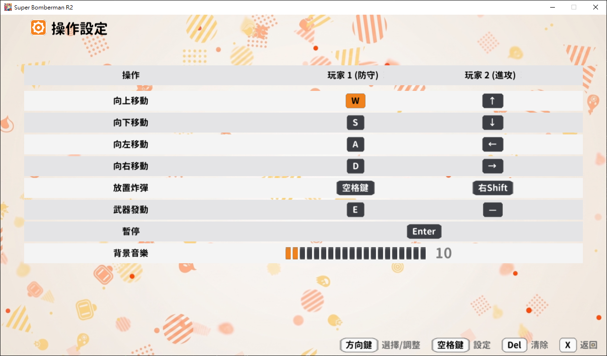

# 2026 OOPL Final Report

## 組別資訊

組別：T45  
組員：113820032 曾靖諺  
復刻遊戲：超級炸彈人  

## 專案簡介

### 遊戲簡介
超級炸彈人 是一款參考 Super Bomberman R2 中城堡模式的遊戲，原作 Super Bomberman R2 為 3D 版本，擬定改將原作的城堡模式復刻為類似 Super Bomberman 5 的 2D 版本，雙方圍繞場地上的「鑰匙」與「寶箱」展開攻防對決。  

遊戲分為 `進攻方` 與 `防守方`。  

`進攻方` 最多可達 8 人，閃避炸彈、陷阱、源石精靈與防守方的武器攻擊，最終使用鑰匙開啟終點所有的寶箱即為勝利。  

`防守方` 只有 1 人，利用地圖陷阱、炸彈與源石精靈防禦進攻方。只要在時間內守住任一寶箱，就能獲得勝利。  

* **會死掉：** 
  - **進攻方：** 進攻方會遭受陷阱、源石精靈、炸彈爆炸波及、防守方的武器攻擊，當人物受到攻擊則死亡，死亡的進攻方將掉落身上的鑰匙，並進入重生倒數。  
  - **防守方：** 防守方會遭受陷阱、炸彈爆炸波及，當人物受到攻擊則有 3 條命，前 2 條會原地暈倒一段時間，最後 1 條用盡則死亡，並進入重生倒數。  
* **會獲勝：**
  - **進攻方獲勝：** 成功取得鑰匙並成功開啟所有寶箱
  - **防守方獲勝：** 成功拖延至倒數計時結束
* **有關卡：** 每個關卡都有不同的陷阱、寶箱、源石精靈配置

### 組別分工
單人實作，無須分工

## 遊戲介紹

### 遊戲規則

**基本操作**
- `ESC`：於主選單或遊戲封面按 `ESC` 可以開啟結束遊戲確認框
- `ENTER`：於遊戲中按 `ENTER` 可以開啟暫停選單，可選擇繼續、作弊開關、再次開始、返回房間
- `F3`：開啟 / 關閉 Debug Overlay 與 ImGui 主控台（即時改金幣、即殺指定玩家、強制進攻方獲勝、可視化危險地圖等）

預設按鍵（可於操作設定畫面自訂並保存）：

| 動作 | 玩家 1（守方） | 玩家 2（攻方） |
|:----:|:----:|:----:|
| 上 / 下 / 左 / 右 | W / S / A / D | ↑ / ↓ / ← / → |
| 放置炸彈 | Space | Right Shift |
| 武器發動 | E | （守方專用） |

**對戰流程**
1. 遊戲封面 → 主選單 → 戰鬥選項 → 進入對戰
2. 對戰中畫面上方顯示倒數計時、剩餘寶箱數，人物頭頂以皇冠顯示防守方、鑰匙顯示持有鑰匙的進攻方
3. 倒數結束（防守方勝）或所有寶箱被開啟（進攻方勝）時，進入結算畫面並依表現結算金幣，金幣會保存

**核心機制**
- **炸彈與爆炸：** 雙方皆可放置炸彈，引爆後以十字形向四方延伸火焰，遇到可破壞磚塊則炸毀、遇到不可破壞的無敵牆則停止；火焰會引爆相鄰炸彈（連鎖）
- **鑰匙與寶箱：** 進攻方需在地圖上取得鑰匙，帶到寶箱前開啟，持有鑰匙者死亡會原地掉落鑰匙
- **遊戲道具：** 磚塊被破壞後有機率掉落遊戲道具（55% 掉落空氣、15% 加速鞋 (玩家加速 5 秒 3.0f -> 5.0f)、15% 炸彈道具 (增加可放置炸彈數，上限為 10)、15% 火焰道具 (擴大火焰蔓延半徑，上限為 5)）
- **陷阱地形：** 輸送帶（強制位移）、彈跳板（彈飛角色）、砲台 (發射砲彈，在射程內的玩家砲彈路過會砸暈)
- **源石精靈：** 與防守方合作的 AI 單位，會在地圖上隨機朝四個方向走，發現進攻方則主動追擊
- **防守方武器：** 劍（將前方三格擊倒）、雷射（直線發射擊倒）、屏障（生成暫時牆阻擋），由防守方於賽前選擇，過程中需要充能完成才能使用
- **重生：** 死亡後進入重生倒數 3 秒，於原本的出生點復活

**屬性說明**

| 屬性 | 說明 |
|------|------|
| 生命 (Lives) | 進攻方 1 條；防守方 3 條（前 2 次被擊中只會倒地暈眩 1.5 秒，不會直接死） |
| 移動速度 (Speed) | 預設 3.0；撿到加速鞋後 5 秒內提升到 5.0；AI 進攻方依性格略低於 1.0 倍 |
| 火力 (Firepower) | 炸彈爆炸的十字延伸格數，初始 2，上限 5 |
| 炸彈上限 (MaxBombs) | 可同時存在的炸彈數，初始 3，上限 10 |
| 金幣 (Coin) | 結算時依勝負 / 守住寶箱 / 武器擊倒數結算並寫入存檔 |

**狀態異常**

| 狀態 | 效果 | 解除 |
|------|------|------|
| 倒地暈眩 | 防守方被擊中時若仍有命，會原地暈眩 90 frames 並閃爍，期間不能移動 | 自動起身，並給予 1 秒短暫無敵 |
| 無敵 | 重生 / 起身 / 作弊「無敵」開啟時生效，免疫所有傷害 | 計時結束 / 作弊關閉 |

> 詳細數值定義於 `include/Core/GameConstants.hpp`

### 遊戲畫面

| 說明 | 畫面 |
|------|------|
| 遊戲封面 |  |
| 主選單 |  |
| 操作設定 |  |

## 程式設計

### 程式架構

整體採「分層 + 單一職責」的物件導向設計，以 `App` 為頂層協調者，透過**狀態模式**切換各畫面，遊戲進行時的邏輯再委派給各 **Manager** 與 **Entity**。原始碼依職責分到 `include/` 與 `src/` 下的對應子資料夾：

```
main.cpp ── App（生命週期 / 狀態機 / 共用資源）
                │
                ├── States/        各畫面（狀態模式：IGameState 子類）
                │                  Title / MainMenu / Rules / Settings /
                │                  LevelSelect / TeamSelect / WeaponSelect /
                │                  BattleSetup / Gameplay / GamePaused / Results
                │
                └── Core/GameSession  一場對戰的容器，持有並協調：
                      ├── Managers/   LevelManager（地圖載入/碰撞）
                      │               BombManager（炸彈/爆炸/連鎖）
                      │               InteractableManager（鑰匙/寶箱/陷阱）
                      │               AIManager（進攻方 bot 決策協調）
                      │               CheatManager（作弊）
                      ├── Core/       LevelSpawner（依設定生玩家 / 源石 / 砲台）
                      │               DefenderWeaponSystem（武器 + 充能 + 特效）
                      ├── Entities/   Player / Bomb / Explosion / Spirit /
                      │               Interactable / PlayerBounce /
                      │               PlayerAnimator（方向→貼圖）/
                      │               PlayerLifecycle（死亡/暈眩/重生計時）
                      ├── Turret/     Turret / Projectile / TurretManager（源石砲台）
                      ├── Weapons/    IDefenderWeapon ＋ Sword/Laser/Barrier ＋
                      │               WeaponFactory ＋ FireContext（參數物件）
                      ├── Bot/        Pathfinder（A*）/ DangerMap / BotNavigator /
                      │               BotDecisionMaker（單幀策略樹）
                      ├── Controller/ InputController：HumanController / BotController
                      ├── UI/         UIManager / HUD / DebugConsole / DebugOverlay …
                      ├── Config/     SaveData / KeyBindings / MatchConfig / AppVersion
                      └── Audio/      MusicPlayer
```

下方為省略屬性與方法的純繼承關聯圖：

```mermaid
classDiagram
    direction TB
    class GameObject["Util::GameObject"]
    class IGameState
    class IDefenderWeapon
    class IPlayerEffect
    class InputController
    class IProgrammableController
    class Interactable
    class InteractableFactory

    GameObject <|-- Player
    GameObject <|-- Bomb
    GameObject <|-- Explosion
    GameObject <|-- Spirit
    GameObject <|-- Turret
    GameObject <|-- Projectile
    GameObject <|-- Interactable
    GameObject <|-- Tile

    Turret <|-- RotatingTurret

    Interactable <|-- Key
    Interactable <|-- Chest
    Interactable <|-- PowerUp
    Interactable <|-- Conveyor
    Interactable <|-- BouncePad

    InteractableFactory <|-- GenericPowerUpFactory
    InteractableFactory <|-- EmptyDropFactory

    IGameState <|-- TitleScreenState
    IGameState <|-- MainMenuState
    IGameState <|-- BattleSetupState
    IGameState <|-- TeamSelectState
    IGameState <|-- WeaponSelectState
    IGameState <|-- LevelSelectState
    IGameState <|-- RulesState
    IGameState <|-- SettingsState
    IGameState <|-- GameplayState
    IGameState <|-- GamePausedState
    IGameState <|-- ResultsState

    IDefenderWeapon <|-- SwordWeapon
    IDefenderWeapon <|-- LaserWeapon
    IDefenderWeapon <|-- BarrierWeapon

    InputController <|-- HumanController
    InputController <|-- BotController
    IProgrammableController <|-- BotController

    IPlayerEffect <|-- SpeedBoostEffect
    IPlayerEffect <|-- ExtraBombEffect
    IPlayerEffect <|-- FirepowerEffect
```



以下的點代表繼承、後面的字代表解釋：

* `Util::GameObject` — PTSD 框架的基礎遊戲物件（含 z-index、transform）
  * `Player` — 玩家角色（雙方共用同一類，差別在 Team 與 InputController）
  * `Bomb` / `Explosion` / `Spirit` / `Turret` / `Projectile` — 對戰場上各類動態物件
    * `RotatingTurret` — 會自動旋轉並射擊的砲台
  * `Interactable` — 地圖上可互動的物件
    * `Key` — 鑰匙；`Chest` — 寶箱（攻擊方計分目標）；`PowerUp` — 道具（透過建構子注入 `IPlayerEffect`，新增道具不必新增 subclass）；`Conveyor` — 輸送帶；`BouncePad` — 彈跳板
  * `Tile` — 地圖磚塊
* `IGameState` — 場景介面（狀態模式）；11 個畫面各為一個 subclass
* `IDefenderWeapon` — 防守方武器介面（策略模式）；3 把武器各為一個 subclass
* `InputController` — 玩家輸入「讀取」介面；`HumanController` 讀鍵盤、`BotController` 內部由 AI 寫入
* `IProgrammableController` — 「可被外部寫入按鍵」的介面；與 `InputController` 拆開避免 `HumanController` 出現無意義的 stub（ISP）
* `InteractableFactory` — 磚塊掉落物的工廠；`GenericPowerUpFactory` 以建構子注入 effect 與 sprite，新增道具不必再寫新工廠 subclass

**體現的物件導向原則與設計模式**

- **狀態模式（State）：** `IGameState` 為純虛擬介面（`OnEnter / OnUpdate / OnExit / WantsCursor`），每個畫面是一個子類別；`App` 只持有「目前狀態」並負責轉場 `TransitionTo()`。新增畫面不需改動 `App` 主迴圈。
- **策略模式 + 工廠（Strategy + Factory）+ OCP：** 防守方武器抽象為 `IDefenderWeapon::Fire(const FireContext&)`，`Sword / Laser / Barrier` 各自實作；`WeaponFactory` 依 `MatchConfig` 建立對應武器。**新增一把武器只需新增一個子類別 + 工廠加一個 case，完全不動既有武器**（開放封閉原則）。
- **依賴反轉（DIP）：** 武器不直接依賴具體場景，而是透過 `IWeaponEffects`（特效接收端）與 `IWorldContext`（世界查詢）等介面與外界互動，由 `GameSession` 提供實作。`Player::Update(const IWorldContext&)` 同理。
- **單一職責（SRP）：** 原本龐大的 gameplay 邏輯拆成 Manager。`Player::Update` 抽出 `PlayerLifecycle`（死亡/暈眩/重生計時）與 `PlayerAnimator`（方向→貼圖）；`GameSession::LoadLevel` 抽出 `LevelSpawner`；`AIManager` 抽出 `BotDecisionMaker`（單幀策略樹）；AI 又再細分為 `Pathfinder`（通用 A*）、`DangerMap`（哪些格會被火焰掃到、BFS 找安全格）、`BotNavigator`（單一 bot 對地圖的視角與成本函式）。
- **封裝（Encapsulation）：** 各類別資料成員一律 `private`（包含原本被 protected 暴露的 `Turret` 10 個成員與 `Interactable::m_GridX/m_GridY`），子類透過 `protected` 行為介面與基底互動。
- **介面隔離（ISP）：** `InputController`（讀）與 `IProgrammableController`（寫）刻意分家，`HumanController` 只實作前者，不必為 AI 提供無意義的 stub。
- **繼承與多型（Inheritance / Polymorphism）：** `Player`、`Spirit`、`Turret` 等實體皆繼承框架的 `Util::GameObject`；`Spirit` 內部以列舉 `State{PATROL, CHASE, DEAD}` 實作有限狀態機。

### 程式技術

1. **遊戲框架 / 繪圖**  
   以課程框架 PTSD（封裝 SDL2 + OpenGL）為底；圖片與文字皆經由 OpenGL shader（`Resources/shaders/Base.vert`、`Base.frag`）繪製。Release 版以 GUI 子系統連結，雙擊 exe 不會跳 console 視窗。

2. **AI 尋路（A\* + DangerMap）**  
   進攻方 bot 採 **A\*** 演算法（`Pathfinder`，`f = g + h`，以 `std::priority_queue` 做 min-heap），走法成本以 `costFunc` lambda 注入 — 同一份尋路引擎可被「安全走 / 衝目標 / 炸牆開路 / 自殺突擊 / 退路」五種策略重複利用。**DangerMap** 以 BFS 評估「現有炸彈與未來炸彈火焰會掃到哪些格」與「離自己最近的安全格」。`BotDecisionMaker` 在決定放彈前會先 `FindSafeSpot + FindPath` 驗證「逃生路徑真的走得到」，可行才放，並 `RegisterPendingBomb` 通知後續 bot — 修掉多 bot 同時放彈互炸的 bug。

3. **AI 性格（Strategy Pattern）**  
   `IBotProfile` 描述每隻 bot「想怎麼玩」 — 反應速度、是否主動追防守方、衝目標的膽量、自殺突擊距離等。`BotController` 持有一個 `shared_ptr<const IBotProfile>`，`LevelSpawner::SpawnPlayers` 依席位給每隻 bot 不同性格（獵人 / 拾荒 / 狂戰 / 謹慎輪替），整場 AI 行為才不會像複製貼上。

4. **地圖資料驅動**  
   關卡以文字檔 `Resources/Map/level_*.txt` 定義，`LevelManager` 載入後生成磚塊 / 出生點 / 互動物件；不同關卡套用不同 `TileSet`。新增關卡只要加一張地圖檔 + 一行 `TileSet`，程式不必動。

5. **設定持久化（單一設定來源）**  
   `config.json` 是版本號、視窗、作者的單一來源 — `gen_rc.ps1` 由它產生 exe 版本資訊、`package.ps1` 由它命名 zip、`AppVersion` 由它供標題畫面顯示「版本 1.1」。升版只需改 `config.json` 一處。其餘執行期狀態（金幣 / 音量 / 自訂按鍵）以 nlohmann/json 寫入 `Resources/` 下的 json，關閉重開仍保留。

6. **Debug Mode**  
   F3 開啟 ImGui 主控台（`DebugConsole`）與資訊疊層（`DebugOverlay`） — 可即時改金幣、即殺指定玩家、強制進攻方獲勝、補滿武器充能、可視化危險地圖、顯示 FPS 與 AI 內部狀態。

7. **音訊**  
   `MusicPlayer` 封裝背景音樂播放，切換畫面時換曲且同曲不重播；音量自存檔讀取後即時套用。

8. **記憶體管理（Robust Memory Management）**  
   全程以 `std::shared_ptr` / `std::unique_ptr` 管理物件 — 程式碼中**沒有任何 raw `new` / `delete`**。所有多型基底類（`IGameState / IDefenderWeapon / IWeaponEffects / IWorldContext / IPlayerEffect / InputController / IProgrammableController / Interactable / InteractableFactory / Turret`）皆明確宣告 `virtual ~Class() = default`。唯一的 raw 資源 `SDL_Cursor*` 在 `~App()` 內 `SDL_FreeCursor`。Debug 建置在 `main.cpp` 開啟 CRT 記憶體洩漏偵測，正常退出為零洩漏。

9. **跨工具鏈建置與打包**  
   專案可同時以 **MSVC（Visual Studio）** 與 **MinGW（CLion）** 建置：在 `CMakeLists.txt` 設 `CMAKE_POLICY_VERSION_MINIMUM=3.5` 修掉新版 CMake 對舊版 SDL2 子專案的相容問題；Release 以 GUI 子系統連結（MSVC `/SUBSYSTEM:WINDOWS /ENTRY:mainCRTStartup`；MinGW `-mwindows -static`）。`scripts/package.ps1` 會自動偵測編譯器、把對應的 runtime DLL（MSVC 的 VC++ runtime / MinGW -static 不必帶）一併納入，產出可直接發佈的 zip。

### 使用到 AI/AI Agent 的部分
開發過程中使用 **Gemini、Claude** 協助以下工作：
- **OOP 架構審查：** 以 OOP 的 SOLID 五原則，請 AI 讀取整個 `include/` 與 `src/` 的內容，對於違反原則的部分，AI 會給予 檔案 / 行號 / 建議，再由我決定哪些要修，並由我自己給予修正的具體方向後，再讓 AI 實施改動
- **輔助程式開發：** 由於進度壓力，我採取 我決定具體方向 -> AI 實作程式 -> 我做 code review -> 根據類型決定是我改還是 AI 改 (例如 UI 渲染問題、AI 的邏輯太過一致等這種需要實際遊玩測試的部分就由我自行完成，若是須對程式做大幅改動或 god class 問題則由 AI 協助拆分問題並實作)
- **PTSD 框架除錯：** 例如我將 debug 模式轉為 Release 後打包發布，就遇到在其他電腦會圖片 / 文字不顯示的問題，AI 幫助我了解整個框架的內容，並檢測出是因為 shader 路徑寫死成開發機的絕對路徑，打包未帶 shader 的問題，最後將 shader 納入 `Resources/shaders/` 並改相對路徑後解決
- **開發環境相容：** 同學幫忙測試時發現 CLion 無法正確編譯的問題，我根據錯誤內容與 AI 一同處理完成

## 結語

### 問題與解決方法

| 問題 | 解決方法 |
|:----|:----|
| `Player::Update` 一個函式同時處理輸入、物理、暈眩、死亡、重生、無敵閃爍、彈跳、轉向、加速計時 9 件事，長到看不到尾 | 抽出 `PlayerLifecycle`（死亡/暈眩/重生計時的狀態機）與 `PlayerAnimator`（方向→貼圖陣列），Update 變成「Tick lifecycle → 依結果決定要不要 return → 跑剩下的物理」三段乾淨流程（SRP）。 |
| `GameSession::LoadLevel` 一次做 7 件事（載地圖 / 生玩家 / 配 AI / 生源石 / 生砲台 / 初始 UI / 初始武器）共 97 行 | 抽出 `LevelSpawner` 三個方法（`SpawnPlayers / SpawnSpirits / SpawnTurrets`），LoadLevel 縮為 10 行的高層協調；新增可選實體型別只要加一個 method + 一行呼叫（OCP）。 |
| `AIManager::Update` 內為單隻 bot 的策略樹（危險逃跑 → 安全追物件 → 衝目標 → 炸牆 → 自殺突擊 → 靠近等待）佔 230 行 | 抽出 `BotDecisionMaker::DecideForBot`，`AIManager` 只保留協調（Rebuild 危險地圖 / 目標分派 / for 迴圈），策略樹獨立可讀（SRP）。 |
| `IDefenderWeapon::Fire` 5 個獨立參數很長、未來加上下文要動所有 subclass | 包成 `FireContext` 參數物件；新增上下文（音效、震動）不必改 3 個武器的簽名（OCP）。 |
| `Turret` 10 個 protected 資料成員、`Interactable` 的座標也 protected — 子類能直接亂改基底狀態 | 全部改 private；必要時開 protected 行為介面（`Dir() / SetDir() / TimerLeft() / DecTimer() / StartPhase()` 等）。封裝完整。 |
| `App::LevelName(int)` 用 switch / case，新增關卡要動分支 | 改為 `static const char* const kLevelNames[kNumLevels]` 查表（OCP）。 |
| 版本號散落多處（exe 版本資訊、打包檔名、標題畫面文字） | 集中到 `config.json` 的 `"version"`；`gen_rc.ps1` / `package.ps1` / `AppVersion` 三者同源，升版只改一個檔案。 |
| 打包後的 Release 換台電腦圖片 / 文字全不顯示 | 根因為框架 shader 路徑寫死為絕對路徑、打包未帶 shader。改將 shader 納入 `Resources/shaders/` 並覆寫為相對路徑，打包腳本一併複製。 |
| CLion（CMake 4.2）無法編譯 | 新版 CMake 移除對 `cmake_minimum_required(<3.5)` 的相容，舊版 SDL2 觸發。於專案設定 `CMAKE_POLICY_VERSION_MINIMUM=3.5`，並補 MinGW 的 `-mwindows -static` 設定。 |
| 玩家改過滑鼠游標時出現黑方塊 | SDL 還原預設游標的已知問題；改以 `SDL_CreateSystemCursor(ARROW)` + `SDL_SetCursor` 明確指定游標。 |
| 開關 debug 主控台後人物卡住、要再按方向鍵才恢復 | 框架在 ImGui 抓滑鼠時會連鍵盤事件一起略過，導致方向鍵 KEYUP 遺失、按住狀態卡死。移動改讀 SDL 即時鍵盤狀態 `SDL_GetKeyboardState`，不受此影響。 |
| 進攻方在輸送帶上走不上去 | 修正輸送帶位移與玩家移動的判定順序，並在 `BotDecisionMaker::ExecuteMove` 補按與帶力垂直方向抵銷側偏。 |
| 音效重複播放 / UI 互相遮蔽 | 調整音效觸發時機與 UI 繪製層級（z 值）。 |
| 玩家可多放一顆炸彈（計數變負） | 死亡重生會把炸彈計數歸零，殘留炸彈爆炸時又遞減導致負值；`DecBombCount()` 加下限保護。 |
| AI bot 行為（卡牆 / 不閃炸彈 / 多 bot 同時放彈互炸） | 散落的成本函式收斂為 `BotNavigator`；DangerMap 加 `RegisterPendingBomb` 讓後續 bot 也看得到別人剛放的炸彈；放彈前先 `TryPlanBombEscape` 驗證逃生路徑。 |

### 自評

| 項次 |          項目          | 完成 |
|:----:|:---------------------|:-----:|
| 1    | 這是範例 |  V  |
| 2    | 完成專案權限改為 public |  V  |
| 3    | 具有 debug mode 的功能  |  V  |
| 4    | 解決專案上所有 Memory Leak 的問題  |  V  |
| 5    | 報告中沒有任何錯字，以及沒有任何一項遺漏  |  V  |
| 6    | 報告至少保持基本的美感，人類可讀  |  V  |

### 心得

這次以單人完成《超級炸彈人》城堡模式的 2D 復刻，最大的收穫不是把遊戲做出來這件事，而是把整個專案的 v1.0 寫出來、跑通、發佈出去之後，再回頭做了一次完整的 SOLID 審查 — 然後 v1.1 把那些「能動但結構不對」的地方一個一個拆開重寫。

最有感的是 SRP。`Player::Update` 在 v1.0 是一坨 200 多行的函式，輸入、物理、暈眩、死亡、重生、無敵閃爍、彈跳、轉向、加速計時，全部擠在裡面。當時自己看著還覺得「順著時間軸寫下來不就是這樣？」直到 v1.1 把死亡 / 暈眩 / 重生計時抽成 `PlayerLifecycle`、方向→貼圖抽成 `PlayerAnimator`，`Update` 變成「Tick lifecycle → 看結果決定要不要 return → 跑剩下的物理」三段乾淨流程，才意識到原本那 200 行不是「順著時間軸」，是 9 種職責互相借用同一個變數空間而已。`AIManager` 與 `GameSession::LoadLevel` 也是同樣的故事 — 抽出 `BotDecisionMaker` 與 `LevelSpawner` 後，原本要花兩分鐘讀完一個函式才看得到全貌，現在三個檔案各 10 行就是全貌。

OCP 的部分最有感的是 `IDefenderWeapon::Fire` 簽名長到讓我每次新增武器都要重抄一份。改成 `FireContext` 參數物件之後，三個武器子類的 Fire 都變成單一參數，未來要塞個音效服務 / 觸控震動進去也不必改既有武器 — 一個介面變動成本從「動三個檔」變成「動一個檔」，感覺很值。

另外是 ISP。`InputController`（讀按鍵）與 `IProgrammableController`（被寫入按鍵）一開始我想過要不要塞同一個介面，畢竟 `BotController` 兩者皆是。但若 `HumanController` 也得實作 `SetInput / SetGoal / TickCooldown`，就會多出一堆「永遠不會被呼叫的 stub」 — 而 stub 本身就是壞氣味。拆完之後 `AIManager` 用 `dynamic_cast<IProgrammableController*>` 做能力查詢，`HumanController` 自動被跳過 — 這不是 LSP 違反，而是介面分得乾淨後的自然結果。

最後是發佈這件事。「能在自己電腦跑」跟「能交到別人手上跑」真的是兩件事。打包 v1.0 給朋友試的時候，他點兩下 exe 圖片文字全沒了，蒙了好一陣子才發現是框架把 shader 路徑寫死成我開發機的絕對路徑、打包沒帶到。處理完那個又遇到 MSVC 與 MinGW 兩套工具鏈各有各的 runtime DLL 問題，再到 SDL 的滑鼠游標在改過配置的 Windows 上顯示成黑方塊…每一個都是「自己電腦跑得好好的」結果換台機器就壞的細節。這次 v1.1 也順手把 `config.json` 的 `version` 串到 `gen_rc.ps1` / `package.ps1` / 標題畫面三處 — 升版只要改一個地方，是 SOLID 之外另一個小小的 DRY 實踐。

### 貢獻比例
|      組員      | 貢獻 |
|:--------------:|:----:|
| 113820032 曾靖諺| 100% |
