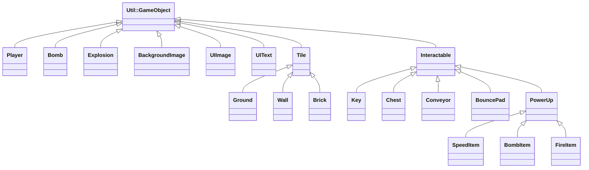
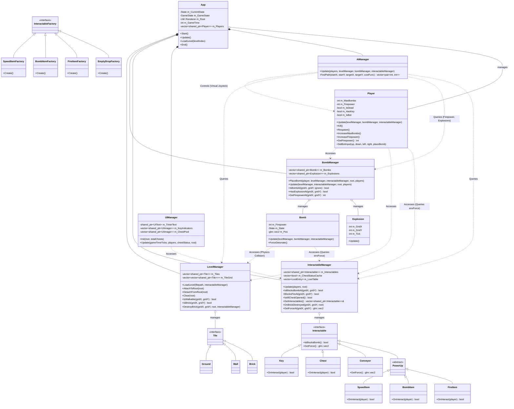

# Abstract

遊戲名稱：超級炸彈人

組員：

- 113820032 曾靖諺

# Game Introduction
超級炸彈人 是一款參考 Super Bomberman R2 中城堡模式的遊戲，原作 Super Bomberman R2 為 3D 版本，擬定改將原作的城堡模式復刻為類似 Super Bomberman 5 的 2D 版本，雙方圍繞場地上的「鑰匙」與「寶箱」展開攻防對決。  

遊戲分為 `進攻方` 與 `防守方`。 

`進攻方` 最多可達 15 人 (視效能調整)，閃避炸彈與陷阱，最終使用鑰匙開啟終點所有的寶箱即為勝利。  

`防守方` 只有 1 人，與源石精靈合作，利用陷阱與武器防守進攻方。只要在時間內守住任一寶箱，就能獲得勝利。  

* **會死掉：** 進攻方會遭受防守方的武器攻擊與爆炸波及，當人物受到攻擊則死亡。死亡的進攻方將掉落身上的鑰匙，並進入重生倒數。
* **會獲勝：**
  - **進攻方獲勝：** 成功取得鑰匙並成功開啟所有寶箱
  - **防守方獲勝：** 成功拖延至倒數計時結束
* **有關卡：** 每個關卡都有不同的城堡、寶箱、源石精靈配置

[遊戲影片](https://www.youtube.com/watch?v=M82WLcZ2_DI) (3:18-6:44)

# Development timeline

- Week 2：準備素材 & 處理遊戲的封面
  - [x] 蒐集遊戲的素材
  - [x] 處理遊戲封面的素材
  - [x] 進行遊戲封面的設計
- Week 3：完成練習 & 遊戲地圖
  - [x] 完成練習
  - [x] 設計地圖儲存與載入機制
  - [x] 設計不同方塊的樣式與用途
- Week 4：角色與炸彈
  - [x] 設計角色移動（移動方式、物件碰撞）
  - [x] 設計雙方放置炸彈機制（炸彈生成、十字爆炸範圍演算）
- Week 5：傷害判定與地形破壞
  - [x] 設計不同方塊遭爆炸波及的反應
  - [x] 設計角色的死亡機制（爆炸波及）
  - [x] 設計破壞方塊後的道具隨機掉落機制（低重要性：視開發進度遞延）
- Week 6：角色重生
  - [x] 設計死亡判定與重生機制
- Week 7：城堡模式核心機制
  - [x] 設計鑰匙與寶箱互動機制
  - [x] 設計死亡鑰匙掉落機制
  - [x] 設計道具拾取與角色狀態強化機制（低重要性：視開發進度遞延）
- Week 8：遊戲關卡切換
  - [x] 設計勝利條件判定（倒計時結束 vs 箱子已全部開啟）
  - [x] 設計過關畫面
- Week 9：遊戲控制（期中考週）
  - [x] 設計 1P、2P 的控制方式（自定義鍵盤控制）
  - [x] 設計 1P、2P 的陣營配置
- Week 10：UI
  - [x] 設計持有鑰匙的人物提示
  - [x] 設計倒數計時提示
  - [x] 設計剩餘寶箱提示
- Week 11：防守方機制
  - [x] 設計源石精靈
  - [x] 設計防守方陷阱 (已完成：輸送帶、彈跳板)
- Week 12：電腦尋路機制
  - [x] 設計進攻方 電腦 尋路演算法（不考慮危險）
  - [x] 設計進攻方 電腦 炸彈開路邏輯（只考慮遇障礙物開路）
- Week 13：電腦尋路機制優化
  - [x] 根據危險重新設計每一個格子的權重
  - [x] 優化進攻方 電腦 躲避炸彈邏輯（包含撤離自身放置的炸彈範圍，實作安全區尋路）
- Week 14：收尾
  - [ ] 設計砲台發射機制
- Week 15：遊戲平衡與效能測試
  - [x] 針對 1 vs N 進行效能測試
  - [x] 調整 AI 能力
  - [x] 調整關卡難度
- Week 16：除錯與測試
  - [ ] 測試是否存在 Bug
  - [ ] 修復目前存在的已知 Bug
- Week 17：完成實習成果
  - [ ] 完成並繳交書面報告

# 程式架構
```
├── Core
│   └── App
│
├── Systems                         # 系統層
│   ├── LevelManager                # 關卡與地圖管理 (載入、破壞、碰撞查詢)
│   ├── BombManager                 # 炸彈管理 (生成、爆炸範圍計算、傷害判定)
│   ├── InteractableManager         # 互動物件管理 (鑰匙、寶箱、道具)
│   └── UIManager                   # 遊戲介面管理
│   └── AIManager                   # AI 決策大腦 (行為樹、泛用型 A*、BFS 求生系統)
│
├── InteractableFactory 	        # 互動物件工廠
│   ├── SpeedItemFactory            # 加速鞋道具工廠
│   ├── BombItemFactory             # 炸彈道具工廠
│   ├── FireItemFactory             # 火焰道具工廠
│   └── EmptyDropFactory            # 空掉落工廠 (沒有道具掉落)
│
└── Util::GameObject
     │
     ├── BackgroundImage             # 開始畫面
     │
     ├── Tile                        # 地圖物件
     │   ├── Ground                      # 草地
     │   ├── Wall                        # 無敵牆
     │   └── Brick                       # 磚塊
     │
     ├── Interactable                # 互動物件
     │   ├── Key                         # 鑰匙
     │   ├── Chest                       # 寶箱
     │   ├── Conveyor                    # 輸送帶
     │   ├── BouncePad                   # 彈跳板
     │   └── PowerUp                     # 掉落道具
     │        ├── SpeedItem               # 加速鞋道具
     │        ├── BombItem                # 炸彈道具
     │        └── FireItem                # 火焰道具
     │
     ├── Bomb                        # 炸彈
     ├── Explosion                   # 火焰
     │
     └── Player                      # 玩家
```

# 繼承關係


# 介面


### 圖層
| Z-Index | 名稱 | 物件 |
| :--- | :--- | :--- |
| **100** | **文字** | `UIText` |
| **99** | **計時器、鑰匙提示、寶箱提示、防守方皇冠、開始畫面** | `UIImage`, `BackgroundImage` |
| **20** | **玩家** | `Player` |
| **18** | **源石精靈** | `Spirit` |
| **15** | **無敵牆** | `Wall` |
| **10** | **火焰** | `Explosion` |
| **6** | **鑰匙、加速鞋、炸彈道具、火焰道具** | `Key`, `SpeedItem`, `BombItem`, `FireItem` |
| **5** | **寶箱、磚塊** | `Chest`, `Brick` |
| **4** | **炸彈** | `Bomb` |
| **1** | **草地** | `Ground` |